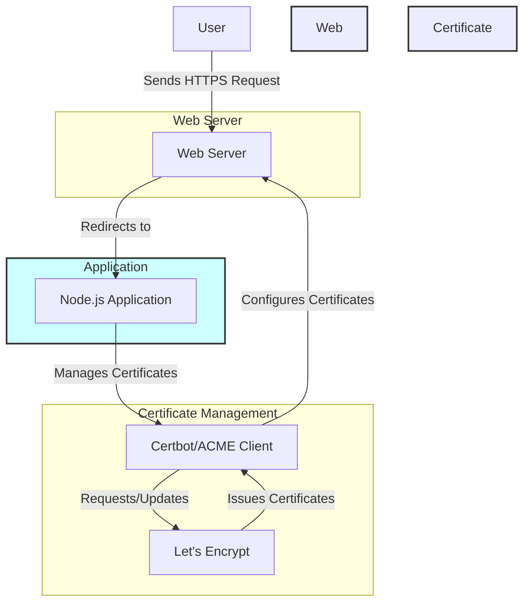

Setting up SSL with Let's Encrypt for a Node.js project involves a few more steps compared to using self-signed certificates. Let's Encrypt provides 
free, trusted SSL certificates. Here's a guide to set up a Node.js project with Let's Encrypt SSL.



Setting up SSL with Let's Encrypt for a Node.js project involves a few more steps compared to using self-signed certificates. Let's Encrypt provides 
free, trusted SSL certificates. Here's a guide to set up a Node.js project with Let's Encrypt SSL.

Step 1: Prerequisites
A domain name: You need a domain name pointing to your server's IP address.
A VPS or cloud server: You need a server that you have SSH access to (for example, on AWS, DigitalOcean, or any cloud provider).
Node.js and NPM installed on your server.

Step 2: Set Up the Project
1. Create a project directory:

```bash
mkdir nodejs-letsencrypt
cd nodejs-letsencrypt
```

2. Initialize a Node.js project:

```bash
npm init -y
```

3. Install Express:

```bash
npm install express
```

Step 3: Install Certbot
Certbot is a tool from the Electronic Frontier Foundation (EFF) that helps you automate the process of obtaining and renewing SSL certificates from 
Let’s Encrypt.

1. Install Certbot: Certbot can be installed via your package manager. For Ubuntu/Debian-based systems:

```bash
sudo apt update
sudo apt install certbot
sudo apt install python3-certbot-nginx
```

2. Generate SSL Certificates: Run Certbot to generate the SSL certificate for your domain:

```bash
sudo certbot certonly --standalone --preferred-challenges http --agree-tos --email youremail@example.com -d yourdomain.com
```

Replace yourdomain.com with your actual domain. If successful, Certbot will generate the certificates in the /etc/letsencrypt/live/yourdomain.com/ 
directory.

Step 4: Create the server.js File
Create a server.js file in your project directory to set up HTTPS using the Let's Encrypt certificates.

```javascript
const express = require('express');
const https = require('https');
const fs = require('fs');
const path = require('path');

// Initialize Express app
const app = express();

// Define the SSL certificate paths
const sslOptions = {
    key: fs.readFileSync('/etc/letsencrypt/live/yourdomain.com/privkey.pem'),
    cert: fs.readFileSync('/etc/letsencrypt/live/yourdomain.com/cert.pem'),
    ca: fs.readFileSync('/etc/letsencrypt/live/yourdomain.com/chain.pem')
};

// Define a basic route
app.get('/', (req, res) => {
    res.send('Hello, Let\'s Encrypt SSL!');
});

// Create an HTTPS server
https.createServer(sslOptions, app).listen(443, () => {
    console.log('Secure server running on https://yourdomain.com');
});
```

Replace yourdomain.com with your actual domain name.

Step 5: Redirect HTTP to HTTPS
To redirect all HTTP traffic to HTTPS, you can also set up a small HTTP server:

```javascript
const http = require('http');

// Redirect HTTP to HTTPS
http.createServer((req, res) => {
    res.writeHead(301, { 'Location': 'https://' + req.headers.host + req.url });
    res.end();
}).listen(80);
```

This will automatically redirect all HTTP requests to HTTPS.

Step 6: Configure Firewall
If you have a firewall enabled (like ufw), make sure to allow both HTTP and HTTPS traffic:

```bash
sudo ufw allow 80
sudo ufw allow 443
```

Step 7: Set Up Auto-Renewal for Let's Encrypt
Let's Encrypt certificates are valid for 90 days, but Certbot makes it easy to renew them automatically. You can check if Certbot's auto-renewal is 
already set up by running:

```bash
sudo certbot renew --dry-run
```

If the dry run is successful, Certbot will automatically renew your certificates when needed.

Step 8: Run the Node.js Application
Start the Node.js application with:

```bash
node server.js
```
Your Node.js server should now be running with a Let's Encrypt SSL certificate, and you should be able to visit your domain securely over HTTPS.

Optional: Use Process Manager (PM2) for Production
For production environments, it’s a good idea to use a process manager like PM2 to keep your Node.js server running:

1. Install PM2:

```bash
npm install pm2 -g
```

2. Start your app with PM2:

```bash
pm2 start server.js
```

This will ensure your Node.js app runs in the background, and PM2 will automatically restart it if it crashes.

